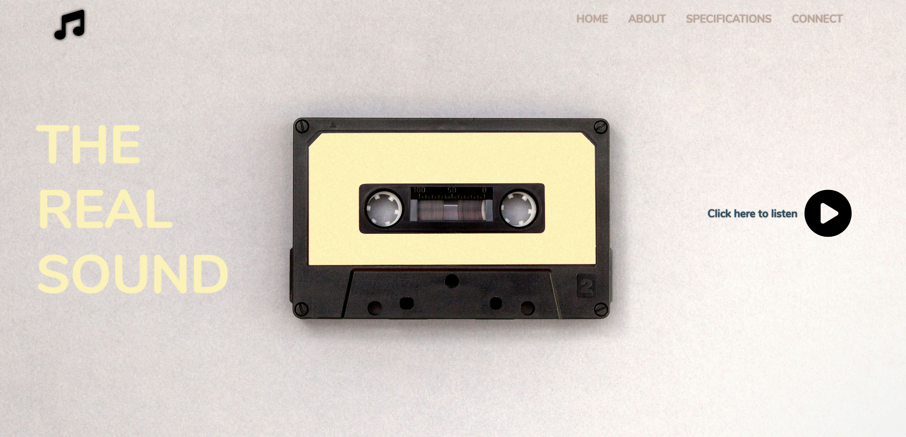

  <h1 style="border-bottom: 2px solid #777; padding-bottom: 10px;">🎵 Music Website Player</h1>

  A simple and elegant web page that allows users to play and pause a predefined song. This project is built using pure HTML, CSS, and JavaScript, utilizing Font Awesome for icons and Google Fonts for typography.

  

<h2>🔗 Live Demo</h2>

👉 <a href="https://music-emad.netlify.app/" target="_blank" rel="noopener noreferrer" style="font-weight: bold; color: #007bff;">https://music-emad.netlify.app/</a>

<h2>🚀 Features</h2>
<ul style="list-style-type: square; padding-left: 20px;">
  <li><strong>Play/Pause Control:</strong> Click the icon to play or pause the music</li>
  <li><strong>Seek Bar:</strong> Control music playback position with a progress bar</li>
  <li><strong>Time Display:</strong> Shows current time and total duration of the track</li>
  <li><strong>Visual Feedback:</strong> The play/pause icon changes according to the music's state</li>
  <li><strong>Basic Responsive Design:</strong> Maintains appearance on various screen sizes</li>
  <li><strong>Clean and Modern UI:</strong> Features a background image and attractive fonts</li>
  <li><strong>Navigation Menu:</strong> Includes basic navigation links</li>
</ul>

<h2>🛠️ Technologies Used</h2>

This project leverages the following technologies:

<table border="0" cellpadding="8" cellspacing="0" width="100%">
  <tr>
    <td width="200px" align="center" valign="top" style="padding-top:12px;"></td>
    <td valign="top"><strong>HTML5:</strong> For the basic structure of the page</td>
  </tr>
  <tr>
    <td width="200px" align="center" valign="top" style="padding-top:12px;"></td>
    <td valign="top"><strong>CSS3:</strong> For styling and page appearance, including Flexbox for layout</td>
  </tr>
  <tr>
    <td width="200px" align="center" valign="top" style="padding-top:12px;"></td>
    <td valign="top"><strong>JavaScript (ES6+):</strong> For the logic of music control and DOM interaction</td>
  </tr>
  <tr>
    <td width="200px" align="center" valign="top" style="padding-top:12px;"></td>
    <td valign="top"><strong>Font Awesome:</strong> For play, pause, and navigation icons</td>
  </tr>
  <tr>
    <td width="200px" align="center" valign="top" style="padding-top:12px;"></td>
    <td valign="top"><strong>Google Fonts (Nunito):</strong> For the font used in the text</td>
  </tr>
</table>

<h2>📂 File Structure</h2>

  
Click to view project structure

  <pre style="background-color: #f0f0f0; border: 1px solid #ddd; border-radius: 3px; padding: 10px; margin-top:10px; overflow-x: auto;">
.
├── audio/
│   └── escalon.mp3 (Audio file)
├── Assests/
│   ├── cover.jpg (Cover music)
│   └── screenshot.png (Screenshot)
├── scripts/
│   └── player.js (JavaScript code for music control)
├── styles/
│   ├── base.css (CSS code for base styles)
│   ├── ui.css (CSS code for ui styles)
│   └── Responsive.css (CSS code for Responsive styles)
└── index.html (Main HTML file)
  </pre>

<h2>🎮 Features</h2>
<ul style="list-style-type: disc; padding-left: 20px;">
  <li><strong>Play/Pause:</strong> Click the play button to start/stop music</li>
  <li><strong>Seek Control:</strong> Click anywhere on the progress bar to jump to that position</li>
  <li><strong>Time Display:</strong> See current position and total duration</li>
  <li><strong>Visual Feedback:</strong> Icon changes between play and pause states</li>
</ul>

<h2>💡 Future Improvements</h2>
<ul style="list-style-type: circle; padding-left: 20px;">
  <li>Add playlist support</li>
  <li>Implement volume control</li>
  <li>Add song information display</li>
  <li>Enable navigation menu</li>
  <li>Support user music uploads</li>
  <li>Enhance mobile responsiveness</li>
</ul>

<h2>🤝 Contributing</h2>

Feel free to contribute through Pull Requests or by opening Issues.

 

  
✨ <em>This README was enhanced with a touch of HTML!</em> ✨

