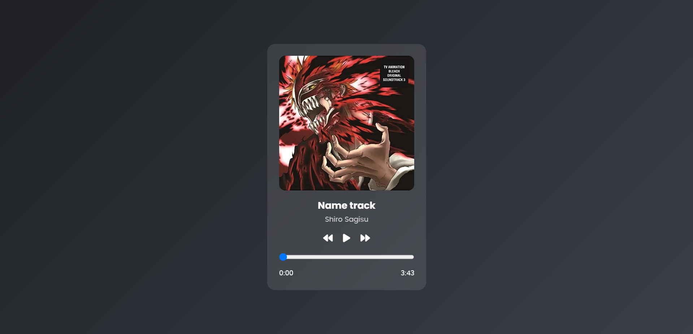

# 🎵 Music Website Player

A simple and elegant web page that allows users to play and pause a predefined song. This project is built using pure HTML, CSS, and JavaScript, utilizing Font Awesome for icons and Google Fonts for typography.



## 🚀 Features

*   **Play/Pause Control:** Click the icon to play or pause the music.
*   **Visual Feedback:** The play/pause icon changes according to the music's state.
*   **Basic Responsive Design:** Attempts to maintain a decent appearance on various screen sizes.
*   **Clean and Modern UI:** Features a background image and attractive fonts.
*   **Navigation Menu:** Includes basic navigation links (currently inactive).

## 🛠️ Technologies Used

*   **HTML5:** For the basic structure of the page.
*   **CSS3:** For styling and page appearance, including Flexbox for layout.
*   **JavaScript (ES6+):** For the logic of music control and DOM interaction.
*   **Font Awesome:** For play, pause, and logo icons.
*   **Google Fonts (Nunito):** For the font used in the text.

## 📂 File Structure

.
├── Assests/

│ ├── escalon.mp3 (Audio file)

│ └── back.jpg (Background image)

├── index.html (Main HTML file)

├── script.js (JavaScript code for music control)

└── style.css (CSS code for styling)

## ⚙️ Setup and Run

1.  **Clone the Repository (or download the files):**
    ```bash
    git clone https://github.com/fakes1011/webpage-music.git
    cd your-project-directory
    ```
2.  **Create the `Assests` Folder:**
    In the project root, create a folder named `Assests`.
3.  **Add Required Files:**
    *   Place an mp3 audio file named `escalon.mp3` into the `Assests` folder.
    *   Place a background image named `back.jpg` into the `Assests` folder.
4.  **Open `index.html`:**
    Open the `index.html` file in your web browser.

## 🎮 How to Use

*   Once the page loads, click the circular play icon (▶️) to start the music.
*   The icon will change to a pause icon (⏸️).
*   To stop the music, click the pause icon again. The icon will revert to the play state.

## 🐛 Known Issues / Limitations

*   **Single Track:** Only one predefined song can be played.
*   **No Advanced Controls:** Lacks volume control, song progress bar, etc.
*   **Inactive Navigation Links:** The links in the navigation menu (HOME, ABOUT, etc.) do not currently lead anywhere.
*   **Dependency on `Assests` files:** The project will not work correctly without the audio file and background image in the correct path.

## 💡 Future Improvements (Suggested)

*   Playlist support.
*   Add volume control.
*   Display a song progress bar (seek bar).
*   Show song information (artist, song title).
*   Activate navigation menu links.
*   Allow users to select or upload music.
*   Enhance responsiveness for various devices.

## 🤝 Contributing

If you'd like to contribute to this project, please feel free to submit a Pull Request or open an Issue to discuss your proposed changes.
